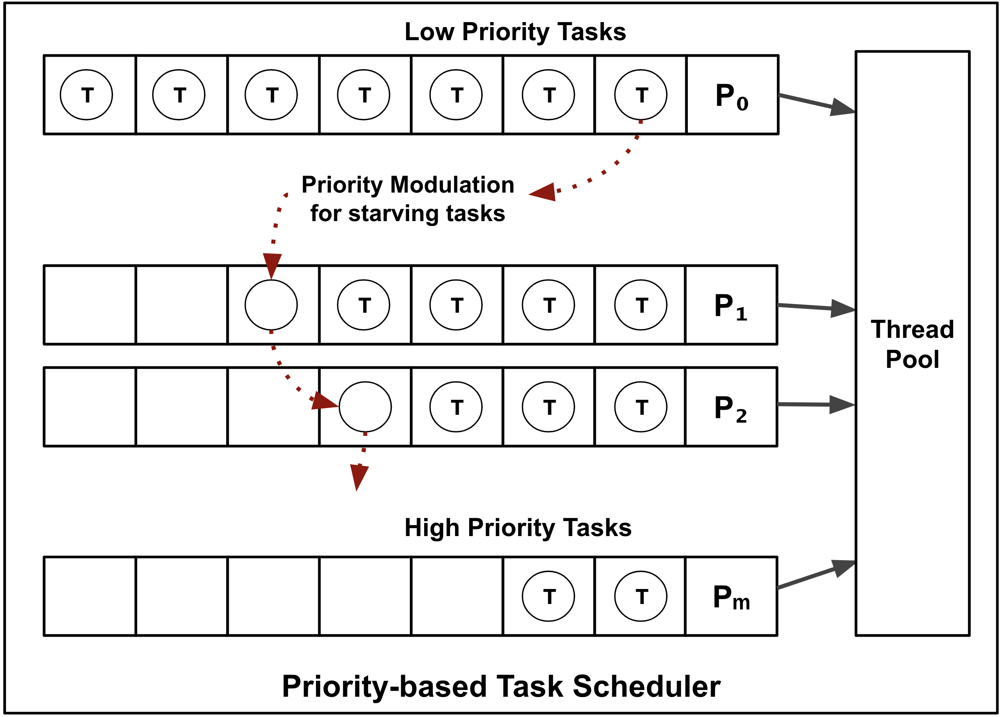

# psched

`psched` is a lightweight library that provides a priority-based task scheduler for modern C++.

## Getting Started

The design of the priority scheduler is as follows:
* The priority scheduler manages an array of concurrent queues, each queue assigned a priority-level
* A task, when scheduled, is enqueued onto one of queues based on the task's priority
* A pool of threads executes ready tasks, starting with the highest priority

<p align="center">
    
</p>

To get started, create a `PriorityScheduler`. 

```cpp
#include <psched/priority_scheduler.h>
using namespace psched;

int main() {
  PriorityScheduler<<threads<4>, priority_levels<5>> scheduler;
}
```

## Generating Single Header

```bash
python3 utils/amalgamate/amalgamate.py -c single_include.json -s .
```

## Contributing
Contributions are welcome, have a look at the CONTRIBUTING.md document for more information.

## License
The project is available under the MIT license.
